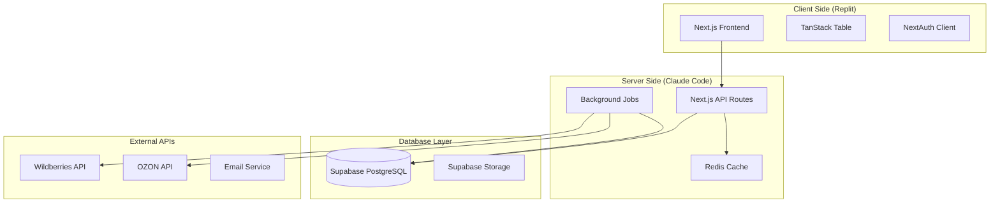

# ПлюсМинус - Техническая Архитектура MVP

## Обзор проекта

**ПлюсМинус** - SaaS платформа для автоматического мониторинга юнит-экономики селлеров маркетплейсов через интерактивные таблицы.

### Ключевые характеристики:
- Поддержка до 50,000 SKU на аккаунт
- Интеграция с Wildberries и OZON API
- Производительность: загрузка таблицы < 2 секунды
- Масштабируемость до 10,000 пользователей
- Соответствие 152-ФЗ

## Архитектура системы

### High-Level архитектура



### Технологический стек

**Frontend (будет в Replit):**
- Next.js 14 с App Router
- TypeScript
- TanStack Table для интерактивных таблиц
- React Query для управления состоянием
- Tailwind CSS + shadcn/ui
- NextAuth.js для аутентификации

**Backend (остается здесь):**
- Next.js API Routes
- TypeScript
- Prisma ORM для работы с БД
- Bull/BullMQ для фоновых задач
- Redis для кэширования
- Node-cron для планировщика

**Инфраструктура:**
- Supabase для PostgreSQL + Auth + Storage
- Vercel для деплоя (фронтенд + API routes)
- Upstash для Redis (кэширование)
- Resend для email

## Разделение ответственности

### Фронтенд (переносится в Replit)
**Папки для переноса:**
- `/app` (страницы и UI компоненты)
- `/components` (React компоненты)
- `/lib/client` (клиентские утилиты)
- `/public` (статические файлы)
- `/styles` (стили)
- `/hooks` (React hooks)

**Ответственность:**
- Пользовательский интерфейс
- Клиентская аутентификация
- Интерактивные таблицы
- Фильтрация и поиск (клиентская часть)
- Экспорт данных

### Бэкенд (API Routes - тоже в Replit, но мы сначала разработаем здесь)
**Папки для разработки здесь:**
- `/app/api` (API эндпоинты)
- `/lib/server` (серверные утилиты)
- `/lib/marketplaces` (интеграции с API)
- `/lib/jobs` (фоновые задачи)
- `/supabase` (схема БД)
- `/types/api` (API типы)

**Ответственность:**
- API Routes для работы с данными
- Интеграция с маркетплейсами
- Расчет юнит-экономики
- Фоновая синхронизация данных
- Serverless функции на Vercel
- Кэширование и оптимизация

## Структура проекта

```
plusminus-mvp/
├── README.md
├── ARCHITECTURE.md
├── package.json
├── tsconfig.json
├── next.config.js
├── tailwind.config.js
├── .env.local.example
├── .gitignore
│
├── app/                          # Next.js App Router
│   ├── layout.tsx               # [FRONTEND] Root layout
│   ├── page.tsx                 # [FRONTEND] Home page
│   ├── globals.css              # [FRONTEND] Global styles
│   ├── (auth)/                  # [FRONTEND] Auth pages
│   │   ├── login/
│   │   └── register/
│   ├── dashboard/               # [FRONTEND] Main dashboard
│   │   ├── page.tsx
│   │   ├── products/
│   │   ├── integrations/
│   │   └── settings/
│   └── api/                     # [BACKEND] API Routes
│       ├── auth/
│       ├── users/
│       ├── products/
│       ├── sync/
│       ├── exports/
│       └── webhooks/
│
├── components/                   # [FRONTEND] React Components
│   ├── ui/                      # shadcn/ui components
│   ├── features/                # Feature-specific components
│   │   ├── auth/
│   │   ├── products/
│   │   ├── table/
│   │   └── integrations/
│   └── layout/                  # Layout components
│
├── lib/                         # Shared utilities
│   ├── client/                  # [FRONTEND] Client utilities
│   │   ├── api.ts
│   │   ├── auth.ts
│   │   └── utils.ts
│   ├── server/                  # [BACKEND] Server utilities
│   │   ├── auth.ts
│   │   ├── db.ts
│   │   ├── cache.ts
│   │   └── encryption.ts
│   ├── marketplaces/            # [BACKEND] API integrations
│   │   ├── wildberries/
│   │   ├── ozon/
│   │   └── types.ts
│   ├── jobs/                    # [BACKEND] Background jobs
│   │   ├── sync-products.ts
│   │   ├── calculate-metrics.ts
│   │   └── worker.ts
│   └── utils/                   # [SHARED] Common utilities
│       ├── validation.ts
│       ├── constants.ts
│       └── types.ts
│
├── hooks/                       # [FRONTEND] React hooks
│   ├── use-products.ts
│   ├── use-auth.ts
│   └── use-filters.ts
│
├── types/                       # TypeScript definitions
│   ├── auth.ts
│   ├── products.ts
│   ├── api.ts
│   └── marketplaces.ts
│
├── prisma/                      # [BACKEND] Database
│   ├── schema.prisma
│   ├── migrations/
│   └── seed.ts
│
├── public/                      # [FRONTEND] Static files
│   ├── icons/
│   └── images/
│
├── docs/                        # Documentation
│   ├── API.md
│   ├── DEPLOYMENT.md
│   └── DEVELOPMENT.md
│
├── scripts/                     # [BACKEND] Utility scripts
│   ├── setup-db.ts
│   └── migrate.ts
│
└── tests/                       # Tests
    ├── api/
    ├── components/
    └── utils/
```

## Разделение на репозитории

### После создания структуры:

1. **Фронтенд в Replit:**
   - Скопировать папки: `app/`, `components/`, `hooks/`, `lib/client/`, `public/`
   - Файлы: `package.json`, `tsconfig.json`, `tailwind.config.js`
   - Настроить переменные окружения для API

2. **Бэкенд остается здесь:**
   - Папки: `app/api/`, `lib/server/`, `lib/marketplaces/`, `lib/jobs/`, `prisma/`
   - Настроить деплой на Railway/Render

## Следующие шаги

1. ✅ Создать базовую структуру проекта
2. 🔄 Настроить Supabase и схему БД
3. ⏳ Создать API endpoints
4. ⏳ Реализовать интеграции с маркетплейсами
5. ⏳ Разделить на фронтенд/бэкенд репозитории