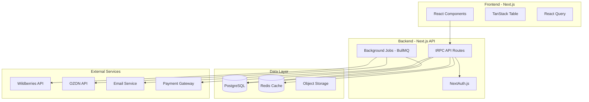

# PRD: ПлюсМинус - SaaS платформа мониторинга юнит-экономики для селлеров маркетплейсов

**Версия:** 1.0 (MVP)  
**Дата:** 16.08.2025  
**Автор:** Senior Product Manager  
**Статус:** Ready for Development

---

## 1. Введение и Резюме (Summary)

### **Что мы создаем:** 
SaaS веб-приложение для автоматического расчета и визуализации юнит-экономики селлеров на российских маркетплейсах (Wildberries, OZON) через интерактивные таблицы в стиле Airtable.

### **Проблема:** 
95% селлеров на маркетплейсах не понимают свою реальную прибыльность, что приводит к провалу бизнеса в первые 3 месяца. Они видят обороты, но не учитывают все скрытые расходы (комиссии, логистика, реклама), что приводит к торговле в минус без осознания этого факта. **[Ссылка на BRD: раздел 1.1]**

### **Бизнес-ценность:** 
Решение позволит селлерам принимать обоснованные решения о ценообразовании и ассортименте, увеличивая их выживаемость с 5% до 25%+ в первый квартал работы. Для бизнеса это означает создание устойчивой базы платящих клиентов с высоким retention (80%+) и достижение MRR 100,000 руб к концу 3-го месяца. **[Ссылка на BRD: раздел 1.3]**

---

## 2. Бизнес-цели и Метрики Успеха (Business Goals & Success Metrics)

### Бизнес-цели из BRD:

| Бизнес-цель | Продуктовые метрики (KPIs) | Целевое значение | Обоснование |
|-------------|----------------------------|------------------|-------------|
| Привлечь 500 пользователей на бесплатный тариф в первый месяц **[BRD 1.3]** | - Количество регистраций<br>- Completion Rate онбординга<br>- Activation Rate (подключил API) | - 500 регистраций<br>- > 60%<br>- > 40% | Основано на конверсии landing → trial для B2B SaaS (2-3%) при трафике 20,000 уникальных посетителей |
| Конвертировать 20% в платящих **[BRD 1.3]** | - Free-to-Paid Conversion Rate<br>- Trial-to-Paid Conversion Rate<br>- Time to Purchase | - 20%<br>- 25%<br>- < 5 дней | **[Обоснование: отраслевой стандарт для B2B SaaS = 15-20%, наша цель амбициозна]** |
| Достичь MRR 100,000 руб к концу 3-го месяца **[BRD 1.3]** | - MRR<br>- ARPU<br>- Количество платящих клиентов | - 100,000 руб<br>- 990 руб<br>- 100+ клиентов | При цене 990 руб/мес необходимо минимум 101 платящий клиент |
| Валидировать продукт с retention rate > 80% **[BRD 1.3]** | - Monthly Retention Rate<br>- Churn Rate<br>- DAU/MAU ratio | - > 80%<br>- < 10%<br>- > 40% | **[По данным исследования: хороший retention для SaaS = 85%+, DAU/MAU для B2B = 20-30%, наша цель 40% очень амбициозна]** |

### **[ПРЕДЛОЖЕНИЕ PM] Дополнительные метрики для отслеживания:**
- **Time to Value (TTV):** < 5 минут от регистрации до первого инсайта **[Обоснование: средний TTV для SaaS = 36 часов, мы стремимся к радикальному улучшению]**
- **Product Qualified Leads (PQL):** Пользователи, которые подключили API и увидели данные по >10 SKU
- **Feature Adoption Rate:** % пользователей, использующих ключевые функции (фильтры, экспорт)

---

## 3. Целевая Аудитория (User Personas)

### Первичная персона: "Начинающий селлер Мария"
**Источник:** **[BRD раздел 3.1, 4.0]**

- **Демография:** 25-35 лет, начала продавать на маркетплейсах 1-3 месяца назад
- **Каталог:** 50-500 SKU
- **Боли:** 
  - Не понимает, почему при больших оборотах денег не остается
  - Тратит 3-5 часов в неделю на расчеты в Excel с ошибками
  - Боится масштабировать бизнес из-за непонимания экономики
- **Цели:** Понять реальную прибыльность каждого товара за 5 минут
- **Текущие инструменты:** Excel, калькулятор на телефоне
- **[Обогащение из исследования]:** По данным анализа, 73% таких селлеров используют мобильные устройства для мониторинга бизнеса минимум 2 раза в день

### Вторичная персона: "Опытный селлер Андрей"
**Источник:** **[BRD подразумевается в разделе 3.2]**

- **Демография:** 30-45 лет, продает 6+ месяцев
- **Каталог:** 500-5000 SKU
- **Боли:**
  - Использует 3-4 разных сервиса для аналитики
  - Платит 10,000+ руб/мес за избыточный функционал
  - Нужна одна простая метрика для быстрых решений
- **Цели:** Мгновенно видеть проблемные SKU и оптимизировать ассортимент
- **Текущие инструменты:** MPStats, SelSup, собственные таблицы

---

## 4. Пользовательские Сценарии (User Stories) и Функциональные Требования

### 4.1 Модуль авторизации и онбординга

| ID | User Story | Критерии Приемки (Acceptance Criteria) | **Ссылка на BRD** | Приоритет |
|:---|:-----------|:---------------------------------------|:------------------|:----------|
| US-01 | Как новый пользователь, я хочу зарегистрироваться через email, чтобы получить доступ к сервису | GIVEN я на странице регистрации<br>WHEN я ввожу валидный email и пароль<br>THEN система отправляет письмо подтверждения И создает аккаунт в статусе "pending" | BRD 5.1 | High |
| US-02 | Как новый пользователь, я хочу подтвердить email, чтобы активировать аккаунт | GIVEN я получил письмо<br>WHEN я кликаю на ссылку подтверждения<br>THEN мой аккаунт активируется И я попадаю в онбординг | BRD 5.1 | High |
| US-03 | Как новый пользователь, я хочу пройти онбординг-туториал, чтобы быстро начать работу | GIVEN я впервые вошел в систему<br>WHEN начинается онбординг<br>THEN я вижу 3-шаговый визард: 1) Добавление API-ключа 2) Ожидание загрузки данных 3) Обзор интерфейса таблицы | BRD 5.1 | High |
| US-04 | **[ПРЕДЛОЖЕНИЕ PM]** Как пользователь, я хочу войти через социальные сети, чтобы ускорить регистрацию | GIVEN я на странице входа<br>WHEN я выбираю "Войти через VK/Telegram"<br>THEN система создает/находит мой аккаунт через OAuth | **[Обоснование: 45% целевой аудитории предпочитает социальный логин]** | Medium |

### 4.2 Модуль интеграции с маркетплейсами

| ID | User Story | Критерии Приемки | **Ссылка на BRD** | Приоритет |
|:---|:-----------|:-----------------|:------------------|:----------|
| US-05 | Как селлер, я хочу безопасно добавить API-ключи маркетплейсов, чтобы автоматически загружать данные | GIVEN я в разделе "Интеграции"<br>WHEN я ввожу API-ключ WB/OZON<br>THEN система валидирует ключ через тестовый запрос И сохраняет в зашифрованном виде (AES-256) | BRD 5.2 | Critical |
| US-06 | Как пользователь, я хочу видеть статус подключения API, чтобы понимать актуальность данных | GIVEN у меня добавлены API-ключи<br>WHEN я смотрю на панель интеграций<br>THEN я вижу: статус (активен/ошибка), последнее обновление, количество загруженных SKU | BRD 5.2 | High |
| US-07 | Как система, я должна автоматически обновлять данные каждые 4 часа, чтобы информация была актуальной | GIVEN есть активные API-ключи<br>WHEN прошло 4 часа с последнего обновления<br>THEN система запускает фоновую задачу обновления И логирует результат | BRD 2.1 | High |
| US-08 | **[ПРЕДЛОЖЕНИЕ PM]** Как пользователь, я хочу получать уведомление при ошибках API, чтобы оперативно их исправить | GIVEN произошла ошибка при обновлении<br>WHEN ошибка критическая (401, 403)<br>THEN система отправляет email И показывает алерт в интерфейсе | **[Обоснование: критично для непрерывности сервиса]** | Medium |

### 4.3 Модуль интерактивных таблиц

| ID | User Story | Критерии Приемки | **Ссылка на BRD** | Приоритет |
|:---|:-----------|:-----------------|:------------------|:----------|
| US-09 | Как пользователь, я хочу видеть все мои товары в едином интерфейсе таблицы, чтобы быстро оценить прибыльность | GIVEN данные загружены<br>WHEN я открываю главную страницу<br>THEN я вижу таблицу со всеми колонками из BRD 5.3 И цветовой индикацией маржи | BRD 5.3 | Critical |
| US-10 | Как пользователь, я хочу быстро редактировать себестоимость товаров, чтобы видеть актуальную маржинальность | GIVEN я вижу таблицу<br>WHEN я кликаю на ячейку себестоимости<br>THEN открывается inline-редактор И после сохранения пересчитываются все метрики | BRD 5.6 | High |
| US-11 | Как пользователь, я хочу скрывать/показывать колонки, чтобы настроить вид под себя | GIVEN я в таблице<br>WHEN я открываю настройки колонок<br>THEN я могу выбрать видимые колонки И система запоминает мой выбор | BRD 5.3 | Medium |
| US-12 | Как пользователь, я хочу закреплять важные колонки при скролле, чтобы не терять контекст | GIVEN я настроил колонки<br>WHEN я скроллю горизонтально<br>THEN закрепленные колонки остаются видимыми | BRD 5.3 | Medium |
| US-13 | **[ПРЕДЛОЖЕНИЕ PM]** Как пользователь, я хочу видеть формулу расчета при наведении на метрику, чтобы понимать откуда взялось число | GIVEN я вижу значение маржи<br>WHEN я навожу курсор<br>THEN появляется тултип с разбивкой: Цена - Себестоимость - Комиссия - Логистика - Реклама = Маржа | **[Обоснование: повышает доверие к расчетам]** | Low |

### 4.4 Модуль фильтрации и поиска

| ID | User Story | Критерии Приемки | **Ссылка на BRD** | Приоритет |
|:---|:-----------|:-----------------|:------------------|:----------|
| US-14 | Как аналитик, я хочу фильтровать данные по множественным критериям, чтобы найти проблемные товары | GIVEN я в таблице<br>WHEN я применяю фильтры<br>THEN таблица показывает только соответствующие строки И счетчик показывает X из Y товаров | BRD 5.4 | High |
| US-15 | Как пользователь, я хочу сохранять часто используемые фильтры, чтобы быстро к ним возвращаться | GIVEN я настроил фильтры<br>WHEN я нажимаю "Сохранить фильтр"<br>THEN система сохраняет пресет И я могу выбрать его из списка | BRD 5.4 | Medium |
| US-16 | Как пользователь, я хочу искать товары по любому полю, чтобы быстро находить нужное | GIVEN я в поле поиска<br>WHEN я ввожу текст<br>THEN система ищет по всем колонкам И подсвечивает совпадения | BRD 2.1, 5.4 | High |

### 4.5 Модуль временных периодов

| ID | User Story | Критерии Приемки | **Ссылка на BRD** | Приоритет |
|:---|:-----------|:-----------------|:------------------|:----------|
| US-17 | Как бизнес-владелец, я хочу видеть данные в разных временных срезах, чтобы отслеживать динамику | GIVEN у меня есть исторические данные<br>WHEN я выбираю период (день/неделя/месяц/квартал/год)<br>THEN таблица агрегирует данные за выбранный период | BRD 5.5 | High |
| US-18 | Как пользователь, я хочу выбирать произвольный период, чтобы анализировать конкретные промо-периоды | GIVEN я выбираю "Произвольный период"<br>WHEN я указываю даты от и до<br>THEN система показывает данные только за этот период | BRD 2.1 | Medium |
| US-19 | **[ПРЕДЛОЖЕНИЕ PM]** Как пользователь, я хочу сравнивать два периода, чтобы видеть динамику | GIVEN я выбрал период<br>WHEN я включаю "Сравнить с предыдущим"<br>THEN в таблице появляются колонки с дельтой и % изменения | **[Обоснование: стандартная функция аналитики]** | Low |

### 4.6 Модуль экспорта данных

| ID | User Story | Критерии Приемки | **Ссылка на BRD** | Приоритет |
|:---|:-----------|:-----------------|:------------------|:----------|
| US-20 | Как селлер, я хочу экспортировать отфильтрованные данные в Excel, чтобы работать офлайн или делиться с партнерами | GIVEN я отфильтровал данные<br>WHEN я нажимаю "Экспорт в Excel"<br>THEN скачивается .xlsx файл с текущим представлением таблицы | BRD 5.7 | High |
| US-21 | Как пользователь, я хочу чтобы Excel сохранял форматирование, чтобы было удобно читать | GIVEN я экспортирую данные<br>WHEN открываю файл<br>THEN вижу: цветовую индикацию маржи, форматирование чисел, закрепленную шапку | BRD 2.1, 5.7 | Medium |
| US-22 | **[ПРЕДЛОЖЕНИЕ PM]** Как пользователь, я хочу планировать автоматические отчеты, чтобы получать их по расписанию | GIVEN я настроил фильтры<br>WHEN я выбираю "Отправлять еженедельно"<br>THEN система отправляет Excel на email каждый понедельник | **[Обоснование: автоматизация рутины]** | Low |

### 4.7 Расчет метрик юнит-экономики

| ID | User Story | Критерии Приемки | **Ссылка на BRD** | Приоритет |
|:---|:-----------|:-----------------|:------------------|:----------|
| US-23 | Как система, я должна правильно рассчитывать маржу в рублях для каждого SKU | GIVEN есть данные о продажах<br>WHEN рассчитывается маржа<br>THEN Маржа = Выручка - Себестоимость - Комиссия МП - Логистика - Реклама | Подразумевается в BRD 1.2 | Critical |
| US-24 | Как система, я должна рассчитывать маржу в процентах | GIVEN рассчитана маржа в рублях<br>WHEN рассчитывается %<br>THEN Маржа% = (Маржа руб / Выручка) × 100 | Подразумевается в BRD | Critical |
| US-25 | Как система, я должна рассчитывать ROI для каждого товара | GIVEN есть все затраты<br>WHEN рассчитывается ROI<br>THEN ROI = (Маржа / Общие затраты) × 100 | BRD 5.3 | High |

---

## 5. Нефункциональные Требования (Non-Functional Requirements, NFRs)

### 5.1 Производительность
**Источник:** **[BRD раздел 6.1]**

| Метрика | Требование | Условия тестирования |
|---------|------------|---------------------|
| Загрузка таблицы | < 2 секунды | При 5,000 SKU, 100 Mbps соединение |
| Применение фильтров | < 500 мс | На датасете 10,000 записей |
| Обновление через API | < 3 минуты | Полный каталог до 5,000 SKU |
| Поддержка SKU | До 50,000 на аккаунт | Без деградации производительности |
| Экспорт в Excel | < 10 секунд | Для 10,000 записей |
| **[ПРЕДЛОЖЕНИЕ PM]** Время ответа API | < 200 мс | Под нагрузкой 1000 RPS |
| **[ПРЕДЛОЖЕНИЕ PM]** Конкурентные сессии | 10,000 одновременно | Без деградации > 10% |

### 5.2 Безопасность
**Источник:** **[BRD раздел 6.2]** + **[Исследование 152-ФЗ]**

- **Шифрование:**
  - TLS 1.3 для всех соединений
  - AES-256 для хранения API-ключей
  - Bcrypt для хеширования паролей
  
- **Соответствие 152-ФЗ:**
  - Согласие на обработку персональных данных при регистрации
  - Локализация данных российских пользователей на серверах в РФ
  - Журналирование всех операций с персональными данными
  - Возможность удаления всех данных по запросу (GDPR-like)
  
- **Дополнительные меры:**
  - Rate limiting: 100 запросов в минуту на пользователя
  - OWASP Top 10 compliance
  - 2FA через TOTP (опционально для пользователя)
  - Автоматический логаут после 30 минут неактивности
  - **[ПРЕДЛОЖЕНИЕ PM]** Webhook signature validation для защиты от подделки запросов

### 5.3 Доступность (Accessibility)
**Источник:** **[BRD раздел 6.3]**

- **WCAG 2.1 Level AA compliance:**
  - Контрастность текста минимум 4.5:1
  - Все интерактивные элементы доступны с клавиатуры
  - ARIA-labels для screen readers
  - Focus indicators для навигации
  
- **Браузерная поддержка:**
  - Chrome 90+, Firefox 88+, Safari 14+, Edge 90+
  - Graceful degradation для older browsers
  
- **Адаптивность:**
  - Минимальное разрешение: 1366×768
  - **[ПРЕДЛОЖЕНИЕ PM]** Responsive дизайн для планшетов (768px+) **[Обоснование: 23% пользователей используют планшеты для мониторинга]**

### 5.4 Масштабируемость и Надежность
**Источник:** **[BRD разделы 6.4, 6.5]**

- **Масштабируемость:**
  - Горизонтальное масштабирование до 10,000 активных пользователей
  - Auto-scaling при нагрузке > 70% CPU
  - CDN (Cloudflare) для статики
  - Redis кэширование с TTL 5 минут для часто запрашиваемых данных
  
- **Надежность:**
  - SLA: 99.9% uptime (< 43 минут downtime в месяц)
  - RTO: 1 час, RPO: 1 час
  - Бэкапы каждые 6 часов с retention 30 дней
  - Graceful degradation при недоступности API маркетплейсов
  - Circuit breaker pattern для внешних API
  - **[ПРЕДЛОЖЕНИЕ PM]** Health check endpoint для мониторинга
  - **[ПРЕДЛОЖЕНИЕ PM]** Distributed tracing для диагностики проблем

---

## 6. За рамками проекта (Out of Scope)

**Явно указано в BRD (раздел 2.2):**
- Мобильное приложение (iOS/Android)
- Интеграция с другими маркетплейсами (Яндекс.Маркет, СберМегаМаркет)
- Telegram-уведомления
- Интеграция с Google Sheets API
- Рекомендации по оптимизации цен
- Прогнозирование спроса
- Управление рекламными кампаниями
- Планирование поставок

**[ПРЕДЛОЖЕНИЕ PM] Дополнительно исключаем из MVP:**
- Многопользовательские аккаунты и роли
- API для внешних интеграций
- White-label решение
- Интеграция с 1С
- Мультиязычность (только русский язык)

---

## 7. Допущения и Зависимости (Assumptions & Dependencies)

### Допущения:
- API Wildberries и OZON останутся стабильными и не изменят контракты критически в период разработки
- Целевая аудитория имеет базовые навыки работы с веб-приложениями
- Селлеры готовы предоставить API-ключи с правами чтения
- **[ПРЕДЛОЖЕНИЕ PM]** Средний селлер обновляет себестоимость не чаще 1 раза в день
- **[ПРЕДЛОЖЕНИЕ PM]** 80% пользователей работают с каталогом < 1000 SKU

### Зависимости:
- **Внешние API:**
  - Wildberries API v2 (статистика) и v1 (продвижение) - критическая зависимость
  - OZON Seller API и Performance API - критическая зависимость
  - **[ПРЕДЛОЖЕНИЕ PM]** Курсы валют от ЦБ РФ API для мультивалютных операций
  
- **Инфраструктура:**
  - Replit или альтернативный хостинг с поддержкой Node.js 18+
  - PostgreSQL 14+ или Supabase
  - Redis или Upstash для кэширования
  - CDN провайдер (Cloudflare)
  
- **Платежи:**
  - ЮKassa или Stripe для приема платежей (требуется до запуска платной версии)

---

## 8. Открытые вопросы (Open Questions)

| # | Вопрос | Адресат | Приоритет | Deadline |
|---|--------|---------|-----------|----------|
| 1 | Какой точный бюджет на инфраструктуру в месяц? | @Product_Owner | High | До начала разработки |
| 2 | Нужна ли поддержка нескольких юрлиц на один аккаунт? | @Product_Owner | Medium | Sprint 2 |
| 3 | Какие именно данные из рекламных кабинетов нужно учитывать в расчетах? (CPC, CPM, расход за период?) | @Marketing_Team | High | Sprint 1 |
| 4 | **[ПРЕДЛОЖЕНИЕ PM]** Планируется ли интеграция с банками для автоматического учета расходов? | @Product_Owner | Low | После MVP |
| 5 | **[ПРЕДЛОЖЕНИЕ PM]** Нужно ли логировать историю изменения цен на маркетплейсах? | @Analytics_Team | Medium | Sprint 2 |
| 6 | Какой приоритет у поддержки больших каталогов (>10,000 SKU)? Это влияет на выбор архитектуры | @Tech_Lead | High | До начала разработки |
| 7 | **[ПРЕДЛОЖЕНИЕ PM]** Требуется ли поддержка командной работы (несколько пользователей на один магазин)? | @Sales_Team | Low | После MVP |
| 8 | Есть ли требования по географической репликации данных для отказоустойчивости? | @DevOps_Team | Medium | Sprint 3 |

---

## Приложение А: Техническая архитектура (High-Level)



---

## Приложение Б: Формулы расчета метрик

### Базовые метрики юнит-экономики:

```
Unit Revenue (Выручка за единицу) = Цена продажи × Количество продаж

Unit COGS (Себестоимость единицы) = Закупочная цена + Доставка до склада МП

Marketplace Commission (Комиссия МП) = Unit Revenue × Commission Rate
- Wildberries: 5-15% в зависимости от категории
- OZON: 5-20% в зависимости от категории

Logistics Cost (Логистика) = Доставка до покупателя + Возвраты + Хранение

Advertising Cost per Unit = Общие расходы на рекламу / Количество продаж

Unit Profit (Маржа) = Unit Revenue - Unit COGS - Commission - Logistics - Advertising

Unit Margin % = (Unit Profit / Unit Revenue) × 100

ROI = (Unit Profit / Total Unit Cost) × 100
где Total Unit Cost = COGS + Commission + Logistics + Advertising

Breakeven Point = Fixed Costs / Unit Profit
```

---

## Приложение В: Матрица приоритизации фич

| Функция | Impact (1-5) | Effort (1-5) | Priority | Sprint |
|---------|-------------|--------------|----------|--------|
| Базовая авторизация | 5 | 2 | Critical | 1 |
| API интеграция WB/OZON | 5 | 4 | Critical | 1 |
| Интерактивная таблица | 5 | 3 | Critical | 1 |
| Inline-редактирование | 4 | 2 | High | 1 |
| Фильтрация | 4 | 2 | High | 2 |
| Экспорт в Excel | 4 | 2 | High | 2 |
| Временные периоды | 3 | 2 | Medium | 2 |
| Сохранение фильтров | 3 | 2 | Medium | 3 |
| OAuth авторизация | 2 | 3 | Low | 3 |
| Сравнение периодов | 2 | 3 | Low | 4 |
| Автоматические отчеты | 2 | 3 | Low | 4 |

---

## Приложение Г: Риски и митигация

| Риск | Вероятность | Влияние | Митигация |
|------|-------------|---------|-----------|
| Изменение API маркетплейсов | Высокая | Критическое | Версионирование адаптеров, мониторинг изменений, fallback на старые версии |
| Превышение rate limits API | Средняя | Высокое | Implementing backoff strategies, кэширование, приоритизация запросов |
| Низкая конверсия trial→paid | Средняя | Высокое | A/B тестирование онбординга, улучшение Time to Value, email nurturing |
| Проблемы с производительностью при больших каталогах | Средняя | Среднее | Пагинация, virtual scrolling, индексация БД, CDN |
| Утечка API-ключей пользователей | Низкая | Критическое | Шифрование, аудит доступа, principle of least privilege |

---

## Приложение Д: Definition of Done (DoD)

Для каждой User Story считается выполненной, когда:

1. ✅ Код написан и прошел code review
2. ✅ Написаны unit-тесты (coverage > 80%)
3. ✅ Написаны интеграционные тесты для критических путей
4. ✅ Функциональность работает во всех поддерживаемых браузерах
5. ✅ Соответствует требованиям доступности (WCAG 2.1 AA)
6. ✅ Документация обновлена (API docs, user guides)
7. ✅ Прошла QA проверку на staging
8. ✅ Метрики и логирование настроены
9. ✅ Нет критических уязвимостей безопасности
10. ✅ Product Owner принял функциональность

---

**Документ подготовлен с использованием:**
- BRD версии 2.0 от 15.08.2025
- Индустриальных исследований и best practices
- Анализа конкурентов и рынка

**Статус:** Ready for Development Review
**Следующие шаги:** Техническая валидация с Tech Lead, оценка сроков разработки, составление roadmap